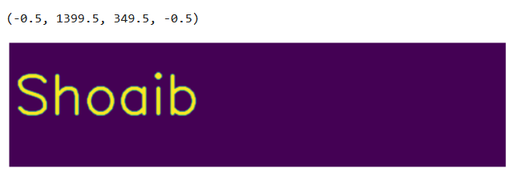
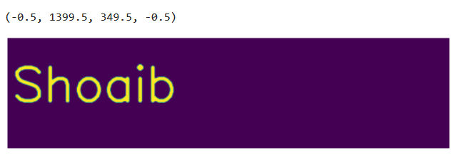

# OPENING--AND-CLOSING
## Aim
To implement Opening and Closing using Python and OpenCV.

## Software Required
1. Anaconda - Python 3.7
2. OpenCV
## Algorithm:
### Step1:
Step1: Import the necessary packages

### Step2:
Give the input text using cv2.putText()

### Step3:
Perform opening operation and display the result

### Step4:
Similarly, perform closing operation and display the result
 
## Program:

``` 
# Import the necessary packages
import cv2
import numpy as np
from matplotlib import pyplot as plt
# Create the text using cv2.putText
img = np.zeros((350, 1400), dtype='uint8')
font = cv2.FONT_HERSHEY_SIMPLEX
cv2.putText(img, 'Shoaib', (15, 200), font, 5, (255), 10, cv2.LINE_AA)
cv2.imshow('created_text', img)
cv2.waitKey(0)
# Create the structuring element
kernel=np.ones((5,5),np.uint8)
kernel1=cv2.getStructuringElement(cv2.MORPH_CROSS,(7,7))
# Use the Opening Operation
image1=cv2.morphologyEx(img,cv2.MORPH_OPEN,kernel)
plt.imshow(image1)
plt.axis("off")
# Use the Closing Operation
image2=cv2.morphologyEx(img,cv2.MORPH_CLOSE,kernel)
plt.imshow(image2)
plt.axis("off")
     
```
## Output:

### Display the input Image


### Display the result of Opening



### Display the result of Closing



## Result
Thus the Opening and Closing operation used in the image using python and OpenCV is successfully executed.